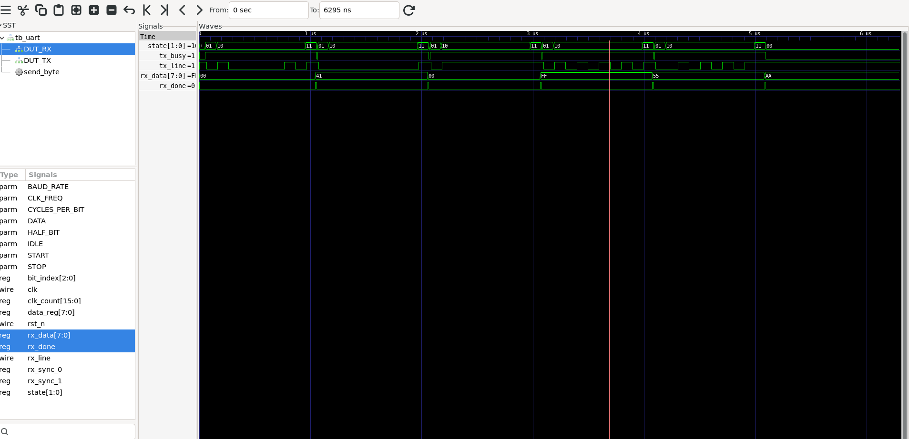

# UART Transmitter + Receiver in Verilog

An 8N1 UART transmitter and receiver written in Verilog, verified with a
self-checking testbench in Icarus Verilog.

## What this project does

- `uart_tx.v` — UART transmitter implemented as a 4-state FSM
  (IDLE → START → DATA → STOP), configurable clock frequency and baud rate
- `uart_rx.v` — UART receiver with a 2-flip-flop input synchronizer
  (to avoid metastability) and mid-bit sampling for timing tolerance
- `tb_uart.v` — self-checking testbench: loops the transmitter's output
  directly into the receiver's input, sends 5 test bytes (including the
  edge cases `0x00` and `0xFF`), and automatically compares every byte
  sent against every byte received

## How to run it

Requires [Icarus Verilog](http://bleyer.org/icarus/) and
[GTKWave](http://gtkwave.sourceforge.net/) (both free, open-source):

```bash
iverilog -o sim.out uart_tx.v uart_rx.v tb_uart.v
vvp sim.out
```

## Result

VCD info: dumpfile uart_tb.vcd opened for output.
PASS: sent 0x41  received 0x41
PASS: sent 0x0  received 0x0
PASS: sent 0xff  received 0xff
PASS: sent 0x55  received 0x55
PASS: sent 0xaa  received 0xaa

*** ALL 5 TESTS PASSED ***
tb_uart.v:85: $finish called at 6295000 (1ps)


## Waveform

View the simulation waveform with:
```bash
gtkwave uart_tb.vcd
```



## Design notes

- 8 data bits, no parity, 1 stop bit (8N1), transmitted LSB-first
- `CLK_FREQ` and `BAUD_RATE` are module parameters — the bit period is
  computed as `CLK_FREQ / BAUD_RATE` clock cycles
- The receiver double-flops its asynchronous input to protect against
  metastability, and samples each bit at the middle of its period to
  tolerate small clock-rate mismatches between transmitter and receiver